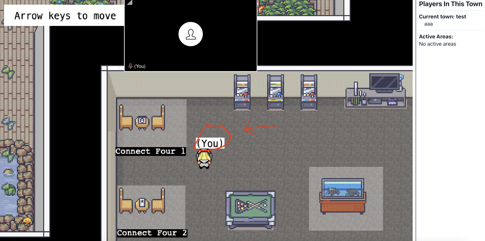

## Introduction

Welcome aboard to the Covey.Town team! We're glad that you're here and ready to join our development team as a new software engineer.
We're building an open source virtual meeting application, and are very happy to see that we have so many new developers who can help make this application a reality.
By the end of the semester, you'll be able to propose, design, implement and test a new feature for our project.
We understand that some of you may have some web development experience, but don't expect that most of you do, and hence, have created this individual project to help you get up to speed with our existing codebase and development environment before the team project begins.

Covey.Town is a web application that consists of some code that runs in each client's web browser, and also code that runs on a server.
Users join the application in a "town": a 2D arcade-style map with different rooms to explore.
Each town is also a video call: when two players get close to each other, they can see and hear each other; there is also a text chat available within the town.
Like most real-world software engineering projects, Covey.Town is not new: the project has been in development since 2021.

## Objectives of this Assignment

The objectives for this first assignment are to:
* get you familiar with the basics of Typescript and the VSC/npm
ecosystem.
* acquaint you with the existing codebase that will serve as the basis
for the group project that you will work on for the rest of the semester.
* ensure that you're a confident enough programmer to succeed in CS 490,
which will regularly ask you to tackle programming tasks using tools,
environments, APIs, etc., with which you are not otherwise familiar.
We don't expect that you've had any formal introduction to TypeScript,
React, NPM, etc., before attempting this assignment: it is mainly testing your ability
to figure things out on your own.

Note that this assignment is due on the same day as the drop deadline.
That is intentional: if you're really struggling to figure out IP0,
we recommend that you drop the course and return to it in a later
semester when you are better prepared.

Based on past experiences, we project that this assignment
could take you up to 10 hours (depending on your prior preparation),
though for most students it should be quicker.
We encourage you to start early so that you can post questions on
Discord and attend office hours as necessary.

**This is an individual assignment.** 

Please post any questions about this assignment on Discord.

This class permits the use of generative artificial intelligence tools
like ChatGPT. You're welcome to use them on this (or any other)
assignment in this class, if you want. However, be aware that
the Covey.Town codebase is confusing for everyone, AI and human alike.
It's _your responsibility_ to interpret the _output_ of a generative
AI tool; the TAs can't and won't help you do so.

## Problem Statement

Your high-level goal in this assignment is to get the Covey.Town codebase
working on your own machine and then make one trivial change: change the
background color of the label for the player to some color other than white.
You'll demonstrate success by recording yourself making the edit, restarting
Covey.Town, and then showing the result after logging in.

## Starter Code and Details

The starter code is available at [https://github.com/kelloggm/covey.town](https://github.com/kelloggm/covey.town).
We recommend that you [fork](https://docs.github.com/en/pull-requests/collaborating-with-pull-requests/working-with-forks/fork-a-repo)
this repository into your own GitHub account.

To help you set up a local development environment for this class, we've prepared a tutorial for [setting up a development environment with NodeJS, VSCode and TypeScript](../tutorials/week1-getting-started.html). Additionally, [An Absolute Beginner's Guide to Using npm](https://nodesource.com/blog/an-absolute-beginners-guide-to-using-npm/) can help you in getting acquainted with `npm`. As a reference for getting started with TypeScript, we suggest the book ["Programming TypeScript" by Boris Cherny](https://learning.oreilly.com/library/view/programming-typescript/9781492037644/). While these resources can help, your specific setup (your OS, your hardware, whatever software is already installed on your computer, etc.) might present some unique difficulties. Figuring out how to deal with those unique difficulties is the crux of this assignment. The course staff might be able to help you, but since most problems are unique we can't offer any guarantees.

### Getting Started

1. Clone the [GitHub repository](https://github.com/kelloggm/covey.town) containing the starter code.
2. Open the `covey.town` folder in VSCode.
3. Open up the VSCode terminal with `ctrl + ~`. Alternatively, you can also open a separate terminal/cmd. Please make sure the shell is in the same folder as your `package.json`.
4. Follow the instructions in the `README.md` file to run the app locally.

### Your Task

Once you have the application running locally, look for the "(You)" tag:

Your objective is to change the color of the white background behind the text
"(You)" to any other color. To figure out how to do that, you'll need to look
at the code! But Covey.Town has about 21,000 lines of code - you can't read
it all in a reasonable amount of time. So, you should target your search:
think about what code must be involved in displaying that tag as you
explore the codebase, and try to systematically narrow down the part of
the system that you have to read in order to figure out where that decision
is made. Searching through a codebase to find what causes a specific,
easy-to-observe effect is a common software engineering activity that you'll
need to do often in this course, so it's good to practice it right away.

Once you find the relevant code, you should record yourself:
* running an unmodified copy of the app
* navigating to the relevant part of the codebase and changing the color
* restarting the app and demonstrating that the new color is visible

Your recording should be no longer than **one minute**.

You can record your screen however you like; it's your responsibility to figure
out how to do so. Consult your favorite search engine to find out how
to record your screen on your operating system.

### Tutorials

We've prepared several [tutorials](../tutorials/) that might be useful for this assignment
(and for understanding Covey.Town generally). The most useful to look at now
are probably:
* [setting up a development environment with NodeJS, VSCode and TypeScript](../tutorials/week1-getting-started.html)
* [TypeScript basics](../tutorials/week1-typescript-basics.html). Most of the Covey.Town
codebase is written in TypeScript, so if you're looking at the code and struggling to read it, this should be your first stop.
* [React basics](../tutorials/react-basics). [React](https://react.dev/) is a user interface library
that Covey.Town builds on. If you're struggling to understand how Covey.Town's graphical interface works, you might want to read this tutorial.

## Rubric

This assignment is "pass/fail": you either get full credit because you've
completed the task, or you don't.

This assignment is the first deliverable of the course project: it is worth 1% of your
project grade, as one of the project's individually-graded components (see the
[project overview](../projects/project-overview.html#summary-of-project-grading)).

After this assignment is due, we will assume that everyone can run Covey.Town
locally.

## Submission Instructions

Submit your video via Canvas ([section 001](https://njit.instructure.com/courses/68176), [section 003](https://njit.instructure.com/courses/72692), [section HM1](https://njit.instructure.com/courses/68186)).

You may submit solutions as many times as you want; only the last
submission before the deadline will be counted.